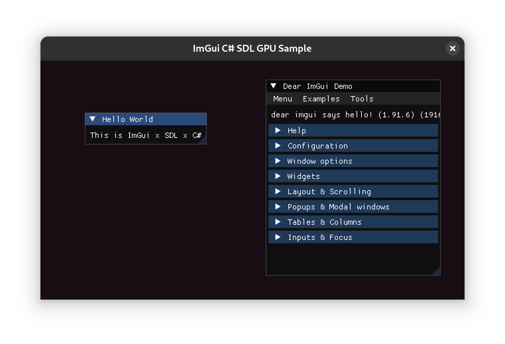

# ImGuiSDL-CS
An ImGui SDL GPU implementation in C#

## References
- [Dear ImGui](https://github.com/ocornut/imgui): The Dear ImGui Project 
- [ImGui.NET](https://github.com/ImGuiNET/ImGui.NET): ImGui C# Bindings (included as a NuGet package)
- [SDL3](https://www.libsdl.org/): The SDL3 Libraru
- [SDL3-CS](https://github.com/flibitijibibo/SDL3-CS/): SDL3 C# Bindings (included as a git submodule)

